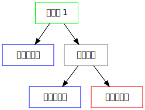

# 方向与切分容器

只有在使用树状的数据结构来维护布局时，
我们才能很自然地理解切分容器（Split Containers）。

在 i3 中，每个容器都有方向
（水平（horizontal），垂直（vertical）或者未指定（unspecified）），
方向与容器中的布局有关
（当使用垂直切分（splitv）或堆叠（stacking）时是垂直方向，
使用水平切分（splith）或标签式（tabbed）是水平方向）。

所以，在上一个例子中，默认的工作区布局是垂直切分
（因为现在大多数屏幕都是横向的），如果我们把它改成垂直切分
（在默认配置文件中是 `$mod+v`），并且打开两个终端，
i3 会这样处理你的两个窗口：

一个关于 i3 自 4 版本以来的有趣的特性是你可以分割几乎所有东西。
假设你现在有两个终端水平切分（也就是水平方向）在一个工作区内，
移动焦点到右边的终端。
现在你想在现在终端的下面打开一个新的终端。
但是如果你现在直接打开终端，它会创建在现在水平切分的右边。
你需要按下 `$mod+v`，来使用垂直切分处理右边的容器
（如果需要水平切分，则使用 `$mod+h`）。
现在你可以打开一个新的终端，它会在刚刚焦点所在的终端的下方：

此时的树形示意图如下（其中的红色表示你目前的焦点）：

你可能已经猜到了，你的切分容器的深度没有限制。

